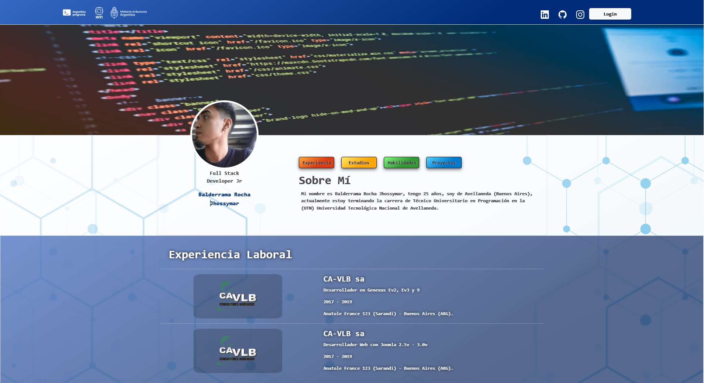

# ©️Proyecto Final Argentina Programa 4.0 🚀 

      

Proyecto Frontend sobre mí portafolio construido con los Framework Angular. Este proyecto cuenta con una coneccion a un Backend creado con Spring Boot y a una BD (Base de datos) MySQL que almacena los datos de mi portafolio.

<a href='https://my-portafolio-7abab.web.app/' title='mi portafolio' target='_blank'>🚀 Mi Portafolio 👈<a/>
## 📌 🖥️ Tecnologías Utilizadas  📱

      

- **Angular 13.3.11:** Framework de desarrollo web (Frontend).
- **Node 16.14.0:** Version node utilizada.
- **Spring Boot 15(Java version 17) :** Desarrollo de API (Backend).
- **MySQL 8.0.9:** Versión del cliente de base de datos Mysql.
- **Bootstrap 5.2.0:** Framework de diseño web que permite crear interfaces de usuario modernas y responsivas.
- **Font Awesome 0.10.0:** Biblioteca de íconos y herramientas para agregar íconos personalizados a la aplicación.

## 📌📁 Características de la aplicación 📚

- **Clases:** Definicion de clases para las entidades utilizadas en mi portafolio.
- **Componentes:** Separacion de componentes por capas para secciones del proyecto.
- **Módulos:** Organizacion de Modulos.
- **Servicios:** Servicios creados para la interaccion con la API (backend) mediante peticiones HTTP y Firebase (Storage de Fotos).
- **Bootstrap:** Se utilizó el framework de diseño web Bootstrap para crear una interfaz de usuario moderna y responsiva, facilitando la visualización y navegación de la aplicación.
- **Font Awesome:** Se agregaron iconos personalizados de Font Awesome a la aplicación para mejorar la experiencia de usuario y hacer la interfaz más atractiva y fácil de usar.
- **Firebase:** La aplicación está desplegada en Firebase, un servicio de Google que permite el alojamiento web y la autenticación de usuarios.

## 📌🔐 Conexiónes Backend y Base de datos ⚙️

- **Render:** Servicio de hosting y deployment de aplicaciones web en la nube (Backend).
- **Clever Cloud:** Servicio de hosting y deployment de aplicaciones en la nube para Java, Node.js, PHP y más (Base de datos).

## 📌 Contacto ✉️
* Gmail: jhossymarbalderrama@gmail.com
